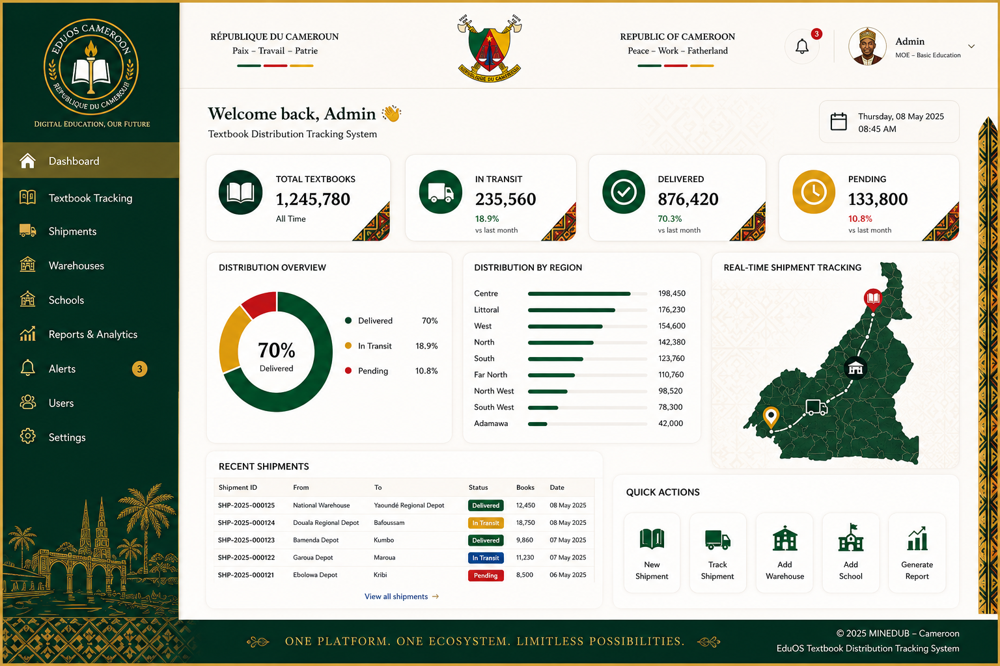

# EduOS Cameroon

## Le système national de gestion du cycle de vie des manuels scolaires

**Briefing exécutif — MINEDUB · MINESEC · Banque mondiale**

Opesware Technologies · Douala, Cameroun
www.opesware.com · eudos@opesware.com · +237 670 41 62 38

Juillet 2026

---

# 1 · Le paradoxe

**Le Cameroun a gagné la bataille de l'achat des manuels.**

- 11+ millions de manuels distribués gratuitement (PAREC)
- Coût unitaire : 6,25 USD → **2,90 USD** (−54 %)
- Ratio : 12 élèves/livre (2016) → **3 livres pour 2 élèves** (2023)

**Mais personne ne sait ce que deviennent ces livres.**

> PETS III (INS, 2019) : **~30 % de la valeur des dotations scolaires disparaît** entre l'envoi et la réception ; délais de 3 à 6 mois pour plus de 80 % des chefs d'établissement.

Source : Banque mondiale, « Turning Pages, Transforming Lives » (2024) ; INS, PETS III Éducation (2019)

# 2 · Ce que le PAREC ne peut pas faire — ni le SIGE

| | PAREC | SIGE | Le manque |
|---|---|---|---|
| Acheter et distribuer les manuels | ✔ | — | |
| Compter les effectifs (1×/an, déclaratif) | — | ✔ | |
| Savoir **où est chaque livre, aujourd'hui** | ✗ | ✗ | **EduOS** |
| Savoir **qui a remis quoi à qui** | ✗ | ✗ | **EduOS** |
| Détecter un écart d'expédition **le jour même** | ✗ | ✗ | **EduOS** |

**Le SIGE est un recensement. Le PAREC est un financement. Il manque le registre de garde — la couche entre l'argent et le comptage.**

# 3 · EduOS : cinq garanties

1. **Un registre unique** des écoles (NSID) et des manuels (NTID) — plus de doublons, plus d'écoles fantômes
2. **Chaque exemplaire a un passeport numérique infalsifiable** — la garde est toujours attribuable
3. **Aucune expédition ne se clôture avec un écart inexpliqué** — la déperdition devient visible
4. **90 jours sans réseau** — tablettes durcies, synchronisation lors d'un déplacement (26 % d'électrification rurale : c'est conçu pour le Cameroun réel)
5. **Tableaux de bord réels** pour les ministères + **les premières données scolaires ouvertes du Cameroun**

# 4 · De l'imprimerie à l'élève

```
Imprimerie ──▶ Entrepôt national ──▶ Entrepôt régional ──▶ École ──▶ Élève
   QR code        réception scannée      chaîne de garde     réception   affectation
   au tirage      contre le lot          signée à chaque     confirmée   et retour
                                         transfert           par l'école  tracés
```

- Chaque flèche = un événement signé, horodaté, attribuable
- Campagne annuelle de vérification : chaque école scanne son stock
- Redistribution intelligente : les surplus rejoignent les pénuries

*Maquette du tableau de bord national :*



# 5 · Les chiffres

| Indicateur | Valeur |
|---|---|
| Programme 5 ans — 18 500 écoles publiques | **11,62 Mds FCFA** (~20,2 M USD) |
| Coût récurrent (régime de croisière) | **1,22 Mds FCFA/an = 0,13 %** des budgets MINEDUB+MINESEC |
| VAN à 10 ans (cas central, 8 %) | **+9,5 Mds FCFA** — 1,65 FCFA par FCFA investi |
| Seuil de rentabilité | Récupérer **2,1 %** du flux — la déperdition mesurée est de **30 %** |
| Équité | Conçu hors-ligne d'abord : les écoles rurales et enclavées d'abord servies, pas dernières |

# 6 · La Banque mondiale le demande déjà

- **2021** : la Banque publie son guide officiel *Track and Trace Systems for Teaching and Learning Materials*
- **Pilotes financés** au Cambodge et en Inde (fonds fiduciaire REACH)
- **Aucun projet africain ne l'a mis en œuvre** — vérifié juillet 2026
- **Aucun bien public numérique (DPG)** n'existe dans cette catégorie

**« Vous avez écrit le guide ; nous avons construit le système ; le Cameroun est le déploiement de référence. »**

Marché de réplication vérifié : Tchad (143,8 M USD, 2027) · Nigéria (552 M USD, 2026) · RDC (867 M USD, 2028-29) · Sierra Leone (106,6 M USD, 2027) · Tanzanie (588 M USD)

# 7 · La fenêtre : 90 jours

- **Le PAREC ferme le 31 décembre 2026**
- Le projet successeur se conçoit **maintenant** — après l'approbation du concept, l'influence chute d'un ordre de grandeur
- La propre feuille de route de la Banque (2024) cite déjà « l'évaluation de la chaîne de distribution »

```
Aujourd'hui ──▶ Décret interministériel ──▶ Réunion TTL ──▶ Composante du successeur
  (semaines 1-4)      (condition n°1)        (semaines 4-12)      PAREC / évaluation
```

# 8 · Le chemin vers le premier livre tracé

| Étape | Contenu | Horizon |
|---|---|---|
| Phase 0 | Prototypes techniques, données carte scolaire, études de référence | avant T0 |
| Phase I | Construction + **pilote : 500 écoles, 2 régions**, une rentrée complète | T0+18 mois |
| Phase II–III | 8 000 puis 18 500 écoles, régions par vagues alignées sur l'année scolaire | T0+42 mois |
| Phase IV | Exploitation nationale stable, transfert à l'équipe nationale | T0+60 mois |

Jalons décisionnels avec protocole d'échec : l'expansion ne se poursuit que sur résultats vérifiés indépendamment.

**Le dossier complet existe : 15 documents de niveau évaluation ex ante, FR/EN — données sourcées, budget détaillé, spécifications contractuelles, S&E, sauvegardes E&S, plan de passation.**

# 9 · Ce que nous sollicitons aujourd'hui

1. **Le portage** : lancer la préparation du décret interministériel (Comité de pilotage conjoint MINEDUB–MINESEC) — condition première de tout financement
2. **La réunion conjointe avec le TTL éducation de la Banque mondiale** à Yaoundé — dans les 90 jours
3. **La revue ministérielle des spécifications** — vos équipes valident les règles de gestion ; nous portons la technique

**Le Cameroun a déjà payé pour les livres.**
**Il n'a pas encore payé pour savoir où ils vont — et le coût de ne pas savoir est mesuré : 30 %.**

Opesware Technologies · Douala · www.opesware.com · eudos@opesware.com · +237 670 41 62 38
Dossier complet : github.com/nshomejude/edu-os
